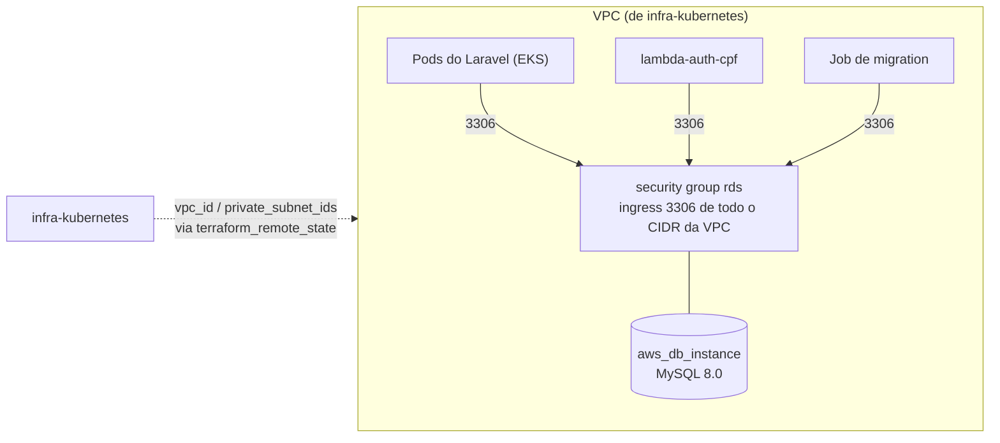

# infra-database

Provisiona o RDS MySQL (banco gerenciado) usado pela aplicação Laravel, dentro da mesma VPC criada pelo repositório `infra-kubernetes`.

## Arquitetura



## O que este repositório cria

- `aws_db_subnet_group` e um security group liberando a porta 3306 para toda a VPC (pods do EKS e a Lambda de autenticação).
- Uma instância `aws_db_instance` (MySQL 8.0), sem Multi-AZ, sem Enhanced Monitoring/Performance Insights (essas duas exigiriam uma IAM role própria, que o AWS Academy não libera).

## Dependência

Este repositório lê os outputs do `infra-kubernetes` via `terraform_remote_state` (mesmo bucket S3, key `infra-kubernetes/terraform.tfstate`). **Rode o `infra-kubernetes` primeiro.**

## terraform.tfvars

```hcl
aws_region      = "us-east-1"
tf_state_bucket = "SEU-NOME-UNICO-DE-BUCKET"   # o mesmo do infra-kubernetes
db_password     = "..."                          # PRECISA ser igual ao DB_PASSWORD usado no repositório da aplicação
```

## Uso local

Veja o `AWS_ACADEMY.md` do repositório `infra-kubernetes` para os passos de credenciais/LabRole — aqui a única diferença é que o RDS em si **não** precisa da `LabRole` (não cria nenhum recurso IAM), só precisa que a VPC do `infra-kubernetes` já exista.

```bash
terraform init \
  -backend-config="bucket=SEU_BUCKET" \
  -backend-config="key=infra-database/terraform.tfstate" \
  -backend-config="region=us-east-1" \
  -backend-config="dynamodb_table=SUA_TABELA_LOCK"

terraform plan
terraform apply
```

## Outputs usados pelo repositório da aplicação

- `rds_address` → vira o `DB_HOST` do configmap da aplicação
- `rds_port` → vira o `DB_PORT`
- `db_name` → vira o `DB_DATABASE`
